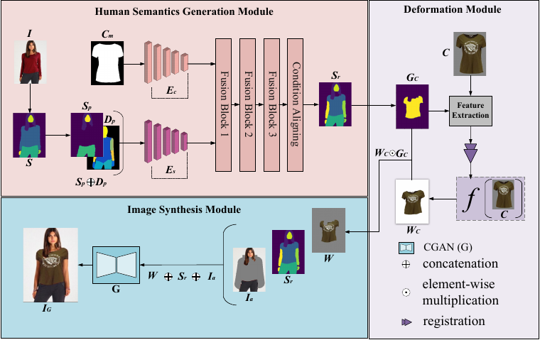
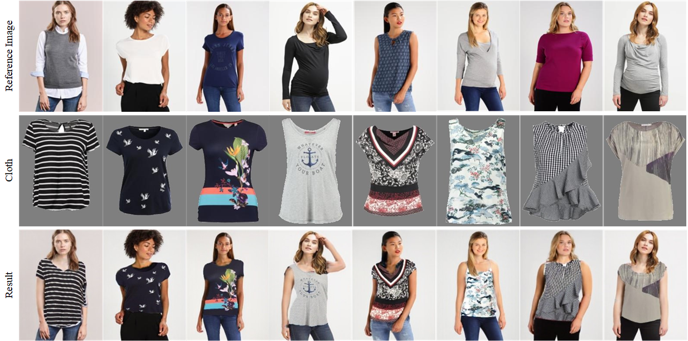

# VITON-DRR: Details Retention Virtual Try-on via Non-rigid Registration

This repo is a pytorch implementation of the virtual try-on paper **VITON-DRR**

## Abstract
Image-based virtual try-on aims to fit a target garment to a specific person image and has attracted extensive research attention because of its huge application potential in the e-commerce and fashion industries. To generate high-quality try-on results,  accurately warping the clothing item to fit the human body plays a significant role, as slight misalignment may lead to unrealistic artifacts in the fitting image. Most existing methods warp the clothing by feature matching and thin-plate spline (TPS). However, it often failed to preserve clothing details  due to self-occlusion, severe misalignment between poses, etc. To address these challenges, this paper proposes a detail retention virtual try-on method via accurate non-rigid registration (VITON-DRR) for diverse human poses. Specifically, we reconstruct a human semantic segmentation using a dual-pyramid-structured feature extractor. Then, a novel Deformation Module is designed for extracting the cloth key points and warping them through an accurate non-rigid registration algorithm. Finally, the Image Synthesis Module is designed to synthesize the deformed garment image and generate the human pose information adaptively. Compared with traditional methods, the proposed VITON-DRR can make the deformation of fitting images more accurate and retain more garment details. The experimental results demonstrate that the proposed method performs better than state-of-the-art methods.

## Installation
`ipdb == 0.13.13`  
`opencv-python == 4.7.0.72`   
`pillow == 9.4.0`  
`torch == 1.12.1`  
`tensorboardX == 2.6`  
`tqdm == 4.65.0`  
`scikit-image == 0.18.3`  
`torchgeometry == 0.1.2`  
`MATLAB 2021b`   

## Data preparation
#### Dataset
**VITON Dataset** This dataset is presented in [VITON](https://github.com/xthan/VITON), containing 19,000 image pairs, each of which includes a front-view woman image and a top clothing image. After removing the invalid image pairs, it yields 16,253 pairs, further splitting into a training set of 14,221 pairs and a testing set of 2,032 pairs.

####  Data Pre-processing
###### 1. DensePose
Please check the [detectron2](https://github.com/facebookresearch/detectron2/tree/main/projects/DensePose) repository. Dense pose image obtained by running `apply_net.py`.

###### 2. Parse agnostic
You can get a parse agnostic image by the code `./segment/get_parse_agnostic.py`.

## Train the segment model
You can train the Human Semantics Generation Module with `./segment/train_condition.py`.

## test 

1. The reconstructed human semantic segmentation results are generated by running `./segment/test_condition.py`.
2. You can run `test.py` to generate virtual try-on results.  

## Checkpoint 
We used the pre-trained models `latest_net_G2.pth` from ACGPN, which can be download [here](https://drive.google.com/file/d/1UWT6esQIU_d4tUm8cjxDKMhB8joQbrFx/view?usp=sharing).  
You can download Human Semantics Generation Module checkpoint from [here] (https://pan.baidu.com/s/1Ds8Rj6ioTFXppE5vkSLI8A?pwd=x67y)

## Results
Examples of virtual try-on results synthesized by our method. Given a reference human body image and a product clothing image, our method can synthesize a high-quality virtual try-on result while preserving garment details.

## Reference
> Han Yang, Ruimao Zhang, Xiaobao Guo, Wei Liu, and Wang
Zuo. Towards photo-realistic virtual try-on by adaptively generating-preserving image content. In IEEE Conf. on Computer Vision and Pattern Recognition (CVPR), pp 7850-7859 (2020). IEEE

> Minqi Li, Richard Yida Xu, Jing Xin, Kaibing Zhang, and Junfeng Jing. Fast non-rigid points registration with cluster correspondences projection. Signal Processing, 170: 107455, 2020.

> Lee, S., Gu, G., Park, S., Choi, S. and Choo, J. High-Resolution Virtual Try-On with Misalignment and Occlusion-Handled Conditions. Proc. of the European Conference on Computer Vision (ECCV), pp 204-219 (2022). Springer