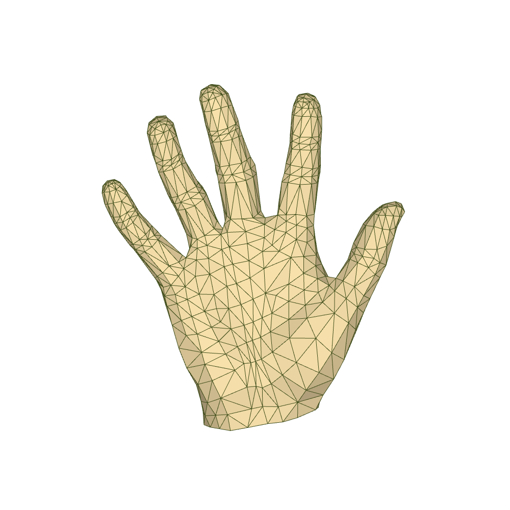
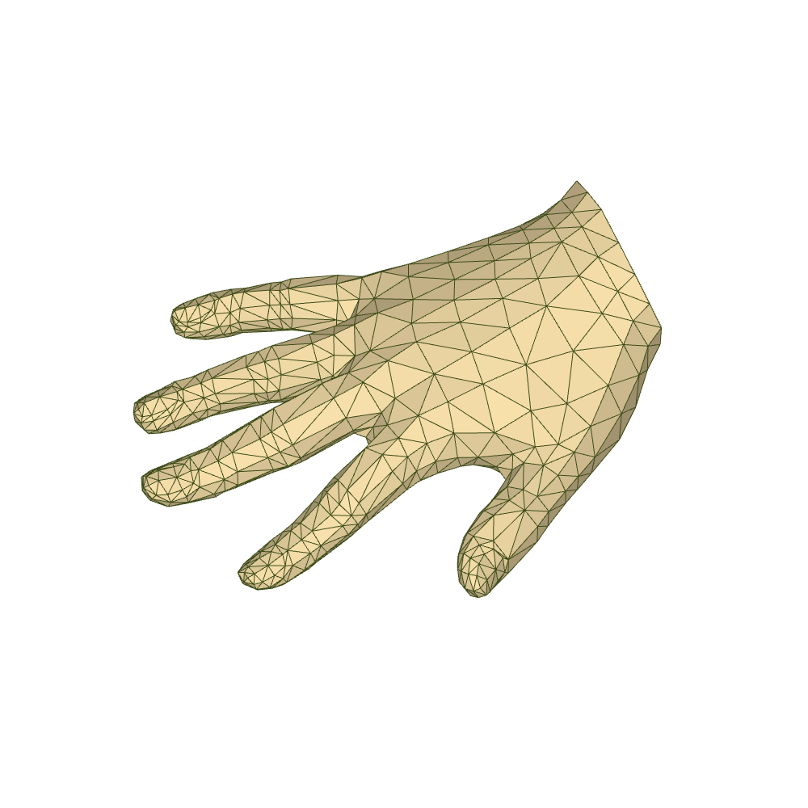

# LiteSpiralGCN:Lightweight 3D Hand Mesh Reconstruction via GCN and Spiral Convolution


## Introduction
This repo is the PyTorch implementation of hand mesh reconstruction described in  paper **LiteSpiralGCN**.

## Update
+ 2024-8-20. Add LiteSpiralGCN model.

## Features
- [x] SpricalGCN
- [x] Attention Sampling
- [x] Weight-Shared Hand Mesh Refinement

## Install 
+ Environment
    ```
    conda create -n LiteSpiralGCN python=3.9
    conda activate LiteSpiralGCN
    ```
+ Please follow [official suggestions](https://pytorch.org/) to install pytorch and torchvision. We use pytorch=1.12.1-cuda11.3, torchvision=0.13.1
+ Requirements
    ```
    pip install -r requirements.txt
    ```
+ You should accept [MANO LICENCE](https://mano.is.tue.mpg.de/license.html). Download the MANO model from [this link](https://mano.is.tue.mpg.de/download.php) and put `MANO_RIGHT.pkl` into [$ROOT/template](template).

## Real-time demo
+ Download the pre-trained weights of LiteSpiralGCN from [Baidu cloud](https://pan.baidu.com/s/1R7pMB7GK_cIpcxw5h0yHqg?pwd=6666) and fill in the correct weight address in line 8 of the [$ROOT/LSG/LiteSpiralGCN.yml](LSG/configs/LiteSpiralGCN.yml).
+ To visualize the 778 vertices of the generated hand mesh using the OpenCV library, and visualize the 21 2D hand keypoints generated in the intermediate stages of the model, please run:
  ```
  python ./LSG/main.py --PHASE demo --config_file .\LSG\configs\LiteSpiralGCN.yml
  ```
  The real-time results during execution are shown in the animated image below.  

  
+ We also utilize the `PyTorch3D` library for more detailed rendering to approximate a more realistic 3D hand. Please run:
  ```
  python ./LSG/main.py --PHASE demo_pt3D --config_file .\LSG\configs\LiteSpiralGCN.yml
  ```
  The real-time results during execution are shown in the animated image below.  
  
## Mesh file generation
+ We simultaneously generate rendered images of the hand mesh and 2D hand pose, along with files in PLY file(e.g., 000_mesh.ply) for the hand mesh. Please run:
  ```
  python ./LSG/main.py --PHASE demo_test_new_data --config_file .\LSG\configs\LiteSpiralGCN.yml
  ```
  NOTE: To make the paths appropriate, please modify the 882nd, 885th, and 936th lines of the [$ROOT/LSG/runner.py](LSG/runner.py).
  
  The following is the demonstration result.
  <p float="left">
  
  </p>
  The following are visualization images of the hand mesh in PLY format from different perspectives.
  <p float="left">
    
    
  </p>

## Dataset preparation
#### FreiHAND
+ Please download FreiHAND dataset from [this link](https://lmb.informatik.uni-freiburg.de/projects/freihand/), and create a soft link in `data`, i.e., `data/FreiHAND`.
+ Download mesh GT file `freihand_train_mesh.zip` from [Baidu cloud](https://pan.baidu.com/s/12X1qsuxO2j8jGl6QWJdV6A?pwd=rc4x), and unzip it under `data/FreiHAND/training`
#### Real World Testset
+ Please download the dataset from [this link](https://github.com/3d-hand-shape/hand-graph-cnn/tree/master/data/real_world_testset), and create a soft link in `data`, i.e., `data/Ge`.
#### Complement data
+ You can download files from [here](https://drive.google.com/drive/folders/1V3Ioy3H1vGPG4mURsCon9TE7j5eGFanN) and unzip it. Then, create a soft link in `data`, i.e., `data/Compdate`.

#### Data dir
```  
${ROOT}  
|-- data  
|   |-- FreiHAND
|   |   |-- training
|   |   |   |-- rgb
|   |   |   |-- mask
|   |   |   |-- mesh
|   |   |-- evaluation
|   |   |   |-- rgb
|   |   |-- evaluation_K.json
|   |   |-- evaluation_scals.json
|   |   |-- training_K.json
|   |   |-- training_mano.json
|   |   |-- training_xyz.json
|   |-- Ge
|   |   |-- images
|   |   |-- params.mat
|   |   |-- pose_gt.mat
|   |-- Compdata
|   |   |-- base_pose
|   |   |-- trans_pose_batch1
|   |   |-- trans_pose_batch2
|   |   |-- trans_pose_batch3
```  
Please fill in the correct dataset address in [$ROOT/LSG/configs/LiteSpiralGCN.yml](LSG/configs/LiteSpiralGCN.yml) or [$ROOT/LSG/configs/defaults.py](LSG/configs/defaults.py).

## Training

+ If you wish to use the test set of FreiHAND directly to guide training, please download the FreiHAND test set labels from [this link](https://lmb.informatik.uni-freiburg.de/data/freihand/FreiHAND_pub_v2_eval.zip). After downloading, the file structure should be as follows:

```
out  
|-- MultipleDatasets 
|   |-- LiteSpiralGCN
|   |   |-- ref
|   |   |   |-- evaluation_errors.json
|   |   |   |-- evaluation_K.json
|   |   |   |-- evaluation_mano.json
|   |   |   |-- evaluation_scale.json
|   |   |   |-- evaluation_verts.json
|   |   |   |-- evaluation_xyz.json
|   |   |-- checkpoints 
|   |   |   |-- mobrecon_GCN_checkpoint_076.pt
|   |   |-- log.log
|   |   |-- board
|   |   |-- test

```  
+ Download the pre-trained weights of densestack from [Baidu cloud](https://pan.baidu.com/s/12X1qsuxO2j8jGl6QWJdV6A?pwd=rc4x) and fill in the correct weight address in line 234 of [$ROOT/LSG/models/densestack.py](LSG/models/densestack.py).
+ Please fill in appropriate training parameters in [$ROOT\LSG\configs\LiteSpiralGCN.yml](LSG/configs/LiteSpiralGCN.yml). Run:
```
python ./LSG/main.py --exp_name LiteSpiralGCN --PHASE train --Local_testing --config_file .\LSG\configs\LiteSpiralGCN.yml
```
## Evaluation
#### FreiHAND
+ Please run the following code to generate the 3D hand mesh vertex file.
```
python ./LSG/main.py --exp_name LiteSpiralGCN --PHASE pred --config_file .\LSG\configs\LiteSpiralGCN.yml
```
JSON file will be saved as [$ROOT/LSG/out/MultipleDatasets/LiteSpiralGCN/](LSG/out/MultipleDatasets/LiteSpiralGCN). You can submmit this file to the [official server](https://competitions.codalab.org/competitions/21238) for evaluation.
+ If you want to use the local FreiHAND test set labels for testing, please run:

```
python ./LSG/main.py --exp_name LiteSpiralGCN --PHASE pred  --Local_testing --config_file .\LSG\configs\LiteSpiralGCN.yml
```
NOTE: Please fill in the correct addresses at lines 473, 474, 475, and 478 in [$ROOT/LSG/runner.py](LSG/runner.py) according to the comments next to the code.

#### Real World Dateset

```
python ./LSG/main.py --exp_name LiteSpiralGCN --PHASE eval --config_file .\LSG\configs\LiteSpiralGCN.yml
```
NOTE: The model has not been trained on `the Real World Dataset`.
## More qualitative results
<p float="left">
  
</p>
<p float="left">
  
</p>

## Acknowledgement
Our experiment is built upon an open-source GitHub repository. We would like to express our gratitude to the authors of the following listed code, whose work has greatly facilitated the progress of our experiment. If their work has been helpful to you, please consider citing them.
+ [HandMesh](https://github.com/SeanChenxy/HandMesh)
+ [SAR](https://github.com/zxz267/SAR)
+ [freihand](https://github.com/lmb-freiburg/freihand)

